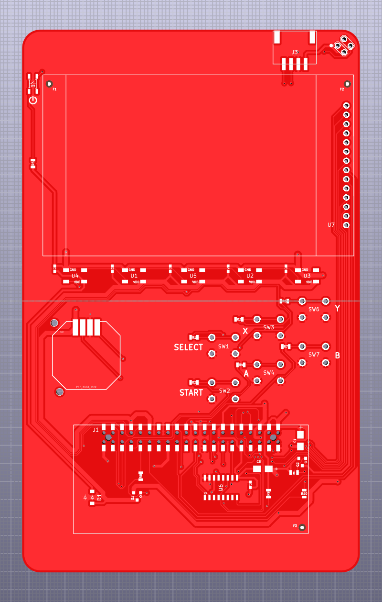

# Hackpack v4 Hardware Collateral
This repo contains all of the hardware collateral you need to create a device functionally equivalent to the [Hackpack v4](https://hackpack.cc/) from [Twilio's SIGNAL 2018](https://signal.twilio.com/) Conference.

<p align="center">
  
</p>

See also our [blog post](https://www.twilio.com/blog/open-source-hardware-badge-hackpack-v4) announcing this repository.

## Hardware Collateral

Everything you need to build a badge PCB can be found in the `KiCad` folder. The Hackpack v4 was designed using KiCad major version 5. [Download a copy here](http://kicad-pcb.org/download/).

You'll also need to purchase a Raspberry Pi Zero W and a 8GB or larger MicroSD card to use the board.

### Don't want to use KiCad?

You can find pre-generated Gerbers in the `KiCad/Gerbers` directory. Use them at your PCB house of choice to manufacture a board.

We've also included the bill of materials and schematic in generic formats.

## Firmware

You can find firmware either [through our repository](https://github.com/twilio/hackpack-v4-firmware/) (start with a vanilla Raspbian installation) or pre-imaged on the [Hackpack v4](https://hackpack.cc/) site.

## Special Assembly Instructions

The Bill of Materials can be found in the `KiCad` directory. Some parts cannot be found at the normal supply sources and are best sourced from Amazon. 

The SMD Grove header was impossible to find in the US at the time this repo was released. Use a through hole Grove header and bend the pins with pliers for an excellent substitute.

The Amazon ILI9341 screen linked in the special assembly instructions has an inverted touchscreen to the one we used at the show. To fix the touchscreen driver you'll need to set flags:

```
echo "100" > /home/pi/.ili9341_touch.conf
sudo reboot
```

## License

Hardware collateral is licensed under [Solderpads 2.0](http://solderpad.org/licenses/SHL-2.0/), a hardware wrapper for the Apache 2.0 license. Please find a copy of both licenses in this repository.