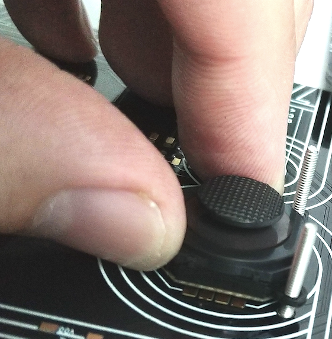
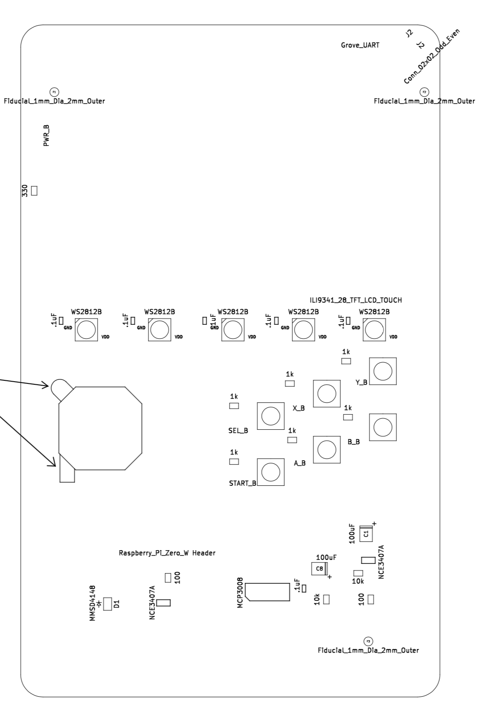

# Hackpack Special Assembly Instructions

1) J3, the Grove Header, is hard to find in the US. For protyotyping, we bent the pins of a TH part since it is the same pitch.
1) U7, the Touchscreen, should be soldered directly to the PCB. The bottom of the SD card should be flush to board (resting on it). It is not connected to the Raspberry Pi.
1) J1, the Raspberry Pi socket is sometimes hard to find depending on buys. Almost any 2.54mm pitch 40 pin 2 row header will work, but it's best to find a _low profile_ one that fits. (For example, HLE-120-02-G-DV-A from Samtec)
1) The joystick is... not great to work with. Here's the soldering method that worked for us:

    1) Insert 2 M2 screws from under the board through the holes
    1) Slide the joystick down the two screws
    1) Slightly lift the edge with the 4 metal pads away from PCB (fingernail width or so)
    1) Using an iron, flood solder on the exposed PCB pad under (tall enough it contacts the joystick pad above)
    1) I used .8mm solder reel
    1) If resistance between adjacent pads is between 3k and 7.5k or so, then I know it isn't shorting and it made contact with the joystick

1) Here is a view of part orientation:

